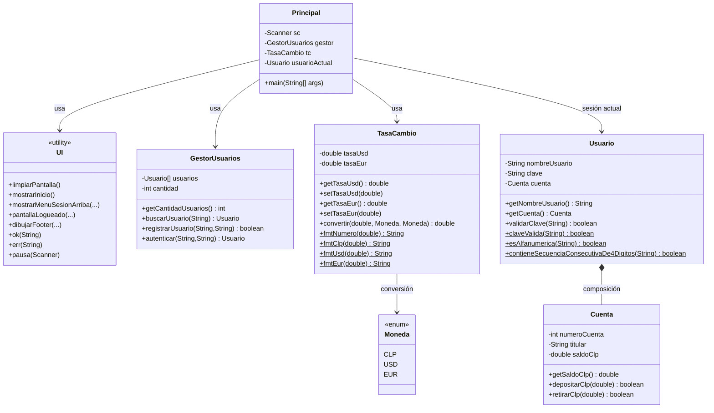

# AlkeWallet (Consola) 💳

Billetera digital en consola desarrollada en **Java 17**, con registro y autenticación de usuario (en memoria), manejo de saldo en CLP y conversión a USD/EUR mediante tasas configurables.
Incluye validaciones de clave, restricción de “solo 1 usuario registrado”, scripts `.sh` para compilar/ejecutar y pruebas unitarias con **JUnit 4**.

---

## Características

- Registro de usuario (solo **1** usuario permitido).
- Login de usuario.
- Cuenta con saldo interno en **CLP**.
- Conversión de moneda CLP ⇄ USD/EUR con tasas configurables.
- Formato numérico **es-CL** (coma decimal y punto de miles) para tasas y montos.
- Validación de clave:
  - mínimo 4 caracteres
  - solo letras y números
  - no permite secuencias de 4 dígitos consecutivos (ej: 1234 / 4321)

---

## Diagrama de clases (Mermaid)





---

## Estructura del repositorio

```text
AlkeWallet_core/
├── src/                         # Código fuente de la aplicación
│   └── com/alkewallet/core/
│       ├── Principal.java       # Entry point de la app (main)
│       ├── UI.java              # UI en consola (layout/menús/footer)
│       ├── GestorUsuarios.java  # Registro/Login (en memoria)
│       ├── Usuario.java         # Modelo + validación de clave
│       ├── Cuenta.java          # Saldo + operaciones CLP
│       ├── TasaCambio.java      # Conversión + formato Locale es-CL
│       └── Moneda.java          # Enum de monedas
│
├── test/                        # Pruebas unitarias
│   ├── com/alkewallet/test/
│   │   ├── CuentaTest.java
│   │   ├── TasaCambioTest.java
│   │   ├── UsuarioTest.java
│   │   ├── GestorUsuariosTest.java
│   │   │ 
│   └── └── TestRunner.java      # Runner con RunListener (salida detallada)
│
├── lib/                         # Dependencias locales
│   ├── junit-4.13.2.jar
│   └── hamcrest-core-1.3.jar
│
├── compile.sh                   # Compila solo la app
├── run_app.sh                   # Compila y ejecuta la app
└── run_tests.sh                 # Compila app+tests y ejecuta pruebas
```

---

##   Manual de uso (funcional)

###  1) Menú inicial

Al iniciar, el sistema muestra:
- Registrar usuario
- Iniciar sesión
- Salir

###  2) Registro de usuario

- Se permite registrar **solo un usuario** (si intentas registrar un segundo, se rechaza).
- La clave debe cumplir:
  - mínimo 4 caracteres
  - solo letras y números
  - sin secuencias de 4 dígitos consecutivos (ej: `1234`, `4321`)

###  3) Login

- Ingresa usuario y clave.
- Si son correctos, se abre el menú de billetera.

###  4) Menú de billetera

Opciones disponibles:
- Ver saldo (elige moneda CLP/USD/EUR).
- Depositar (elige moneda y se convierte a CLP internamente).
- Retirar (elige moneda y se convierte a CLP internamente, valida saldo).
- Cambiar tasas (USD/EUR).
- Cerrar sesión.

> El saldo real se guarda en CLP y el footer muestra CLP/USD/EUR convertidos según las tasas actuales.

---

##  Ejecutar en Eclipse

###  Importar el proyecto

1. `File → Import… → Existing Projects into Workspace`
2. Selecciona la carpeta `AlkeWallet_core/` (la raíz del proyecto).
3. Finaliza el import.

###  Ejecutar la aplicación

1. Abre `src/com/alkewallet/core/Principal.java`
2. Click derecho → **Run As → Java Application**.

###  Ejecutar las pruebas (JUnit)

Tienes 2 alternativas:

**A) Ejecutar tests desde Eclipse**
- Click derecho sobre una clase `*Test.java` → **Run As → JUnit Test**.

**B) Ejecutar el TestRunner (salida detallada)**
- Click derecho sobre `test/com/alkewallet/testrunner/TestRunner.java`
- Run As → Java Application

###  Agregar JUnit al Build Path (sin Maven)

1. Descarga los jars y colócalos en `lib/`
2. Click derecho proyecto → Build Path → Configure Build Path…
3. Libraries → Add JARs… → selecciona `lib/junit-4.13.2.jar` y `lib/hamcrest-core-1.3.jar`

---

##  Ejecutar desde terminal (clonando el repo)

### Requisitos

- Java 17 instalado (`java -version` debe mostrar 17)
- bash (Linux/macOS/WSL)

### Clonar

```bash
git clone (https://github.com/Carl0gonzalez/Alkewallet-EvaluacionModulo2)
cd AlkeWallet_core
```

### Permisos a scripts

```bash
chmod +x compile.sh run_app.sh run_tests.sh
```

### Ejecutar la app

```bash
./run_app.sh
```

### Ejecutar pruebas

Asegúrate de tener los jars en `lib/` y luego:

```bash
./run_tests.sh
```

---

## 🔗 Dependencias (descarga manual)

Este proyecto no usa Maven/Gradle: los jars se agregan en `lib/`.

- JUnit 4.13.2:
  - https://repo1.maven.org/maven2/junit/junit/4.13.2/junit-4.13.2.jar
- Hamcrest Core 1.3:
  - https://repo1.maven.org/maven2/org/hamcrest/hamcrest-core/1.3/hamcrest-core-1.3.jar

---

---

##  Informe de pruebas

###  Alcance y objetivo
El proyecto incorpora un set de **pruebas unitarias** orientadas a validar reglas de negocio y comportamiento de métodos en forma aislada, sin dependencias externas (no se utiliza base de datos ni servicios).  
El objetivo es asegurar la correcta operación de: registro/autenticación, validación de claves, operaciones de saldo y conversión de moneda.

---

###  Herramientas y ejecución
- **Framework:** JUnit 4  
- **Ubicación de pruebas:** `test/com/alkewallet/test/`  
- **Ejecución por terminal:**
  ```bash
  ./run_tests.sh
Salida en consola: el TestRunner imprime el avance por prueba (START/OK/FAIL) y al final un resumen con métricas (cantidad ejecutada, fallidas, ignoradas y tiempo).

| Suite (archivo)           | Unidad bajo prueba | Casos cubiertos (resumen)                                                                                                                         |
|---------------------------|--------------------|---------------------------------------------------------------------------------------------------------------------------------------------------|
| `CuentaTest.java`         | `Cuenta`           | Depósito válido, depósito inválido (0/negativo), retiro válido, retiro rechazado por saldo insuficiente                                           |
| `TasaCambioTest.java`     | `TasaCambio`       | Conversiones CLP↔USD, CLP↔EUR; verificación de formato numérico **es-CL** (coma decimal / punto de miles)                                         |
| `UsuarioTest.java`        | `Usuario`          | Clave mínima, solo alfanumérica, rechazo por caracteres especiales, rechazo por secuencias consecutivas (asc/desc), aceptación sin 4 consecutivos |
| `GestorUsuariosTest.java` | `GestorUsuarios`   | Registro y autenticación, restricción **solo 1 usuario** (no se sobreescribe), rechazo por claves inválidas                                       |


🔗 Pruebas de integración
No se incluyen pruebas de integración “clásicas” (por ejemplo con BD, API REST o servicios externos), ya que la aplicación funciona completamente en memoria y por consola.
Como verificación de integración interna, se validan flujos entre módulos (por ejemplo GestorUsuarios → validación de Usuario y reglas de clave), asegurando que las restricciones definidas se cumplan a nivel de interacción.

## Notas

- Compartido bajo licencia MIT (copia, usa y reconoce)
- Este proyecto fue desarrollado con fines didacticos y educativos. Sientete libre de colaborar y hacer sugerencias. 
